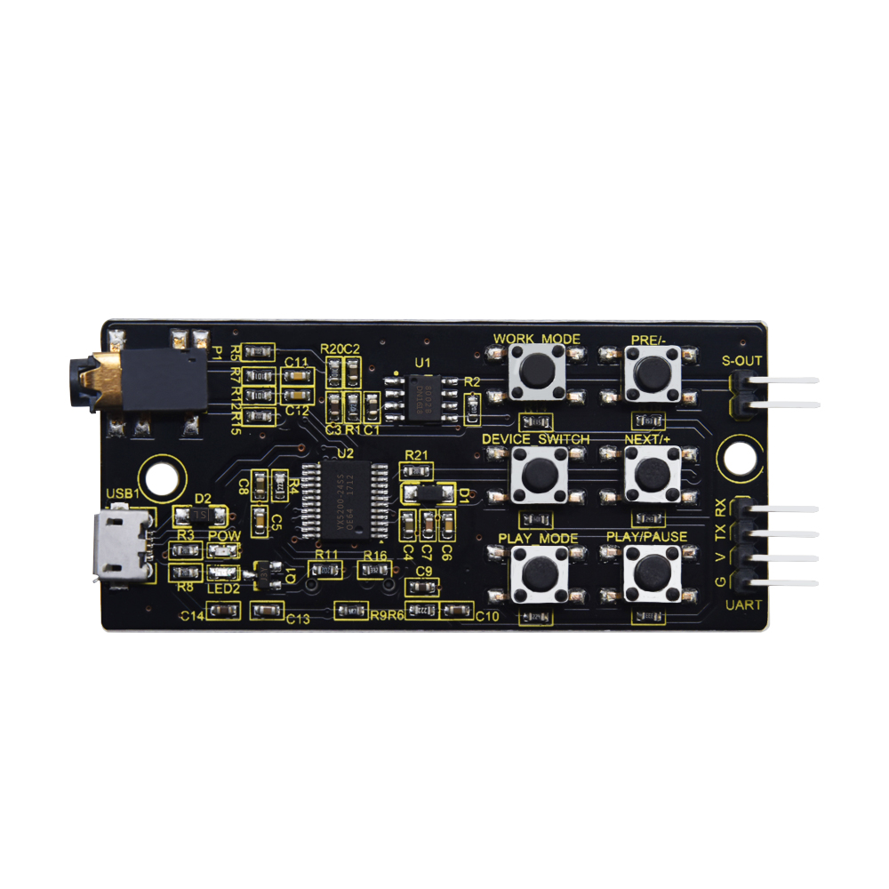

# Keyestudio YX5200-24SS MP3 Module



## 1.Product Description

**Keyestudio YX5200-24SS MP3** module is a music module designed for learning and development. Its core is the YX5200-24SS voice chip, which integrates hardware interfaces for MP3, WAV, and WMA formats and supports TF card operation. It is easy to use, stable and reliable in performance. It mainly includes:

- A built-in TF card slot for direct reading and playback of music stored on the card.
- A built-in serial communication interface (UART) for music playback via serial port.
- A built-in micro USB port (USB1) for reading SD card content and downloading music.
- A built-in headphone jack (P1) for easy connection of headphones to listen to music.
- Integrated audio amplifier chip with built-in speaker interface (S-OUT) for direct connection to external speakers, with 8x audio amplification.
- 6 external buttons for convenient command control and verification.

## 2.Features

- **Multiple audio formats**: Supports audio files in MP3, WAV, and WMA formats.
- **High-fidelity audio output**: Integrates audio amplifier chip, delivering high-quality audio output.
- **Convenient interface**: Features USB, TF card, headphone, and speaker ports for easy connection and use.
- **Simple control method**: Controls music playback via buttons and serial port commands for easy operation.
- **Compact and lightweight**: Features compact module size, which is suitable for various projects and applications.

## 3.Specifications

- **Operating Voltage**: DC 5V
- **Operating Current**: Maximum 1A
- **Maximum power consumption**: 5W
- **Operating Temperature**: 10~40℃
- **Audio Amplification Factor**: 8 times
- **TF cards Support**: Up to 32GB (FAT32)
- **Dimensions**: 33mm × 77mm × 9mm
- **Weight**: 11.2g

## 4.Working Principle

The YX5200-24SS module receives control commands via the UART interface to manage functions such as audio file playback, pause, and volume adjustment. Its built-in audio decoding chip can decode audio files stored on the TF card and output audio signals through the audio amplifier. Users can control its operation status by sending commands via buttons or the serial port.

**Schematic Diagram:**


## 5.Interface and Button Descriptions

- **TF card slot**: For inserting TF cards and reading audio files.

- **USB port**: Used to connect to a computer and download audio files to the TF card.

- **Headphone jack (P1)**: Used to connect headphones to listen to music directly.

- **Speaker output (S-OUT)**: Used to connect external speakers to output audio.

- **Button interface**: Used to manage functions of playback, pause and volume of the module.

|               |                        |                  |                                      |
| :-----------: | :--------------------: | :--------------: | :----------------------------------: |
|   WORK_MODE   |     Playback Mode      |                  |              All cycles              |
|     PRE/-     |        Previous        | Turn volume down |                                      |
|    NEXT/+     |          Next          |  Turn volume up  |                                      |
| DEVICE_SWITCH | Switch playback device |                  |            U/TF/SPI/Sleep            |
|   PLAY_MODE   |      Working Mode      |                  | Switch interruptible/uninterruptible |
|  PLAY/PAUSE   |       Play/Pause       |                  |                                      |


## 6.Collection of control instructions

| Control Command | Function                            | Sent Command                                                 | Remarks                                                      |
| --------------- | ----------------------------------- | ------------------------------------------------------------ | ------------------------------------------------------------ |
|                 | [Next Track]                        | 7E FF 06 01 00 00 00 FE FA EF                                |                                                              |
|                 | [Previous Track]                    | 7E FF 06 02 00 00 00 FE F9 EF                                |                                                              |
|                 | [Specify Track]                     | 7E FF 06 03 00 00 01 FE F7 EF                                | Specify to play the first track                              |
|                 |                                     | 7E FF 06 03 00 00 02 FE F6 EF                                | Specify to play the second track                             |
|                 |                                     | 7E FF 06 03 00 00 0A FE EE EF                                | Specify to play the 10th track                               |
|                 | Volume Up                           | 7E FF 06 04 00 00 00 FE F7 EF                                |                                                              |
|                 | Volume Down                         | 7E FF 06 05 00 00 00 FE F6 EF                                |                                                              |
|                 | [Specify Volume]                    | 7E FF 06 06 00 00 1E FE D7 EF                                | Specify volume to Level 30                                   |
|                 | [Specify EQ]                        | 7E FF 06 07 00 00 01 FE F3 EF                                | Reserved                                                     |
|                 | [Loop Play Track]                   | 7E FF 06 08 00 00 01 FE F2 EF                                | Loop play the first track                                    |
|                 |                                     | 7E FF 06 08 00 00 02 FE F1 EF                                | Loop play the second track                                   |
|                 |                                     | 7E FF 06 08 00 00 0A FE E9 EF                                | Loop play the 10th track                                     |
|                 | [Specify Playback Device]           | 7E FF 06 09 00 00 01 FE F1 EF                                | Specify playback device - UDISK                              |
|                 |                                     | 7E FF 06 09 00 00 02 FE F0 EF                                | Specify playback device - TF                                 |
|                 |                                     | 7E FF 06 09 00 00 03 FE EF EF                                | Specify playback device - PC (Download Mode)                 |
|                 |                                     | 7E FF 06 09 00 00 04 FE EE EF                                | Specify playback device - FLASH                              |
|                 |                                     | 7E FF 06 09 00 00 05 FE ED EF                                | Specify playback device - SLEEP                              |
|                 | [Enter Sleep Mode]                  | 7E FF 06 0A 00 00 00 FE F1 EF                                |                                                              |
|                 | [Wake Up from Sleep]                | 7E FF 06 0B 00 00 00 FE F0 EF                                |                                                              |
|                 | [Module Reset]                      | 7E FF 06 0C 00 00 00 FE EF EF                                |                                                              |
|                 | [Play]                              | 7E FF 06 0D 00 00 00 FE EE EF                                |                                                              |
|                 | [Pause]                             | 7E FF 06 0E 00 00 00 FE ED EF                                |                                                              |
|                 | [Specify Folder & File]             | 7E FF 06 0F 00 01 01 FE EA EF                                | Folder "01", Track "001"                                     |
|                 |                                     | 7E FF 06 0F 00 01 02 FE E9 EF                                | Folder "01", Track "002"                                     |
|                 | Stop Playback                       | 7E FF 06 16 00 00 00 FE E5 EF                                | Stop software decoding                                       |
|                 | Loop Play Specific Folder           | 7E FF 06 17 00 00 01 FE E3 EF                                | Loop play Folder 01                                          |
|                 |                                     | 7E FF 06 17 00 00 02 FE E2 EF                                | Loop play Folder 02                                          |
|                 | Single Track Loop Play              | 7E FF 06 19 00 00 00 FE E2 EF                                | Enable single track loop play                                |
|                 |                                     | 7E FF 06 19 00 00 01 FE E1 EF                                | Disable single track loop play                               |
|                 | Play with Volume                    | 7E FF 06 22 00 1E 01 FE BA EF                                | Play Track 1 at Volume Level 30                              |
|                 |                                     | 7E FF 06 22 00 0F 01 FE C9 EF                                | Play Track 1 at Volume Level 15                              |
|                 |                                     | 7E FF 06 22 00 0F 02 FE C8 EF                                | Play Track 2 at Volume Level 15                              |
|                 | Set DAC                             | 7E FF 06 1A 00 00 00 FE E1 EF                                | Turn on DAC                                                  |
|                 |                                     | 7E FF 06 1A 00 00 01 FE E0 EF                                | Turn off DAC [High Impedance]                                |
|                 | Combined Playback                   | 7E FF 09 21 01 02 02 03 01 04 EF                             | Play [1,2][2,3][1,4] - First number in bracket is folder name, second is track name |
|                 |                                     | 7E FF 15 21 01 02 02 03 01 04 01 03 01 04 01 05 02 08 03 04 03 01 FE 9A EF | With Checksum [1,2][2,3][1,4][1,3][1,4][1,5][2,8][3,4][3,1]  |
|                 |                                     | 7E FF 15 21 01 02 02 03 01 04 01 03 01 04 01 05 02 08 03 04 03 01 EF | [1,2][2,3][1,4][1,3][1,4][1,5][2,8][3,4][3,1]                |
|                 | Stop Advertising Playback           | 7E FF 06 15 00 00 00 FE E6 EF                                | Stop current advertisement and resume background music playback |
|                 | Stop Playback                       | 7E FF 06 16 00 00 00 FE E5 EF                                | Stop software decoding                                       |
|                 | Insert Advertisement                | 7E FF 06 13 00 00 01 FE E7 EF                                | Folder "ADVERT", Track "0001"                                |
|                 |                                     | 7E FF 06 13 00 00 02 FE E6 EF                                | Folder "ADVERT", Track "0002"                                |
|                 |                                     | 7E FF 06 13 00 00 FF FD E9 EF                                | Folder "ADVERT", Track "0255"                                |
|                 |                                     | 7E FF 06 13 00 07 CF FE 12 EF                                | Folder "ADVERT", Track "1999"                                |
|                 |                                     | 7E FF 06 13 00 0B B8 FE 25 EF                                | Folder "ADVERT", Track "3000"                                |
|                 | Insert Advertisement - Multi-Folder | 7E FF 06 25 00 01 01 FE D4 EF                                | Folder "ADVERT1", Track "001"                                |
|                 |                                     | 7E FF 06 25 00 01 02 FE D3 EF                                | Folder "ADVERT1", Track "002"                                |
|                 |                                     | 7E FF 06 25 00 02 01 FE D3 EF                                | Folder "ADVERT2", Track "001"                                |
|                 | Shuffle Play                        | 7E FF 06 18 00 00 00 FE E3 EF                                | Shuffle play all tracks in the current device                |

| Query Command | [Query Volume]                        | 7E FF 06 43 00 00 00 FE B8 EF |                                             |
| ------------- | ------------------------------------- | ----------------------------- | ------------------------------------------- |
|               | [Query Current EQ]                    | 7E FF 06 44 00 00 00 FE B7 EF | This function is reserved                   |
|               | Total Number of Files in UDisk        | 7E FF 06 47 00 00 00 FE B4 EF | Total number of files in the current device |
|               | Total Number of Files in TF           | 7E FF 06 48 00 00 00 FE B3 EF |                                             |
|               | Total Number of Files in FLASH        | 7E FF 06 49 00 00 00 FE B2 EF |                                             |
|               | Current Track in UDisk                | 7E FF 06 4B 00 00 00 FE B0 EF | Currently playing track                     |
|               | Current Track in TF                   | 7E FF 06 4C 00 00 00 FE AF EF |                                             |
|               | Current Track in FLASH                | 7E FF 06 4D 00 00 00 FE AE EF |                                             |
|               | Query Total Tracks in Specific Folder | 7E FF 06 4E 00 00 01 FE AC EF |                                             |
|               | Query Total Folders in Current Device | 7E FF 06 4F 00 00 00 FE AC EF | Supports TF card, UDisk and FLASH           |

| Return Information | UDisk Inserted                          | 7E FF 06 3A 00 00 01 xx xx EF |                                           |
| ------------------ | --------------------------------------- | ----------------------------- | ----------------------------------------- |
|                    | TF Inserted                             | 7E FF 06 3A 00 00 02 xx xx EF |                                           |
|                    | PC Inserted                             | 7E FF 06 3A 00 00 04 xx xx EF |                                           |
|                    | UDisk Removed                           | 7E FF 06 3B 00 00 01 xx xx EF |                                           |
|                    | TF Removed                              | 7E FF 06 3B 00 00 02 xx xx EF |                                           |
|                    | PC Removed                              | 7E FF 06 3B 00 00 04 xx xx EF |                                           |
|                    | Finish Playing Track 1 in UDisk         | 7E FF 06 3C 00 00 01 xx xx EF | Completion of Track 1 playback in UDisk   |
|                    | Finish Playing Track 2 in UDisk         | 7E FF 06 3C 00 00 02 xx xx EF | Completion of Track 2 playback in UDisk   |
|                    | Finish Playing Track 1 in TF            | 7E FF 06 3D 00 00 01 xx xx EF | Completion of Track 1 playback in TF card |
|                    | Finish Playing Track 2 in TF            | 7E FF 06 3D 00 00 02 xx xx EF | Completion of Track 2 playback in TF card |
|                    | Finish Playing Track 1 in FLASH         | 7E FF 06 3E 00 01 01 xx xx EF | Completion of Track 1 playback in FOLDER1 |
|                    | Finish Playing Track 2 in FLASH         | 7E FF 06 3E 00 02 02 xx xx EF | Completion of Track 2 playback in FOLDER2 |
|                    | UDisk -- Online                         | 7E FF 06 3F 00 00 01 xx xx EF | Devices are in an OR relationship         |
|                    | TF -- Online                            | 7E FF 06 3F 00 00 02 xx xx EF |                                           |
|                    | PC -- Online                            | 7E FF 06 3F 00 00 04 xx xx EF |                                           |
|                    | FLASH -- Online                         | 7E FF 06 3F 00 00 08 xx xx EF |                                           |
|                    | UDisk & TF -- Online                    | 7E FF 06 3F 00 00 03 xx xx EF |                                           |
|                    | TF Card & FLASH -- Online               | 7E FF 06 3F 00 00 0A xx xx EF |                                           |
|                    | TF & PC -- Online                       | 7E FF 06 3F 00 00 06 FE B6 EF |                                           |
|                    | UDisk, TF Card, PC, FLASH -- All Online | 7E FF 06 3F 00 00 1F xx xx EF |                                           |
|                    | Finish Playing Track 1 in UDisk         | 7E FF 06 3C 00 00 01 xx xx EF | Completion of Track 1 playback in UDisk   |
|                    | Finish Playing Track 2 in UDisk         | 7E FF 06 3C 00 00 02 xx xx EF | Completion of Track 2 playback in UDisk   |
|                    | Finish Playing Track 1 in TF            | 7E FF 06 3D 00 00 01 xx xx EF | Completion of Track 1 playback in TF card |
|                    | Finish Playing Track 2 in TF            | 7E FF 06 3D 00 00 02 xx xx EF | Completion of Track 2 playback in TF card |
|                    | Finish Playing Track 1 in FLASH         | 7E FF 06 3E 00 01 01 xx xx EF | Completion of Track 1 playback in FOLDER1 |
|                    | Finish Playing Track 2 in FLASH         | 7E FF 06 3E 00 02 02 xx xx EF | Completion of Track 2 playback in FOLDER2 |

| Error Information | Return Busy                 | 7E FF 06 40 00 00 01 xx xx EF | When the module is initializing the file system         |
| ----------------- | --------------------------- | ----------------------------- | ------------------------------------------------------- |
|                   | Current in Sleep Mode       | 7E FF 06 40 00 00 02 xx xx EF | Sleep mode only supports specified devices              |
|                   | Serial Port Reception Error | 7E FF 06 40 00 00 03 xx xx EF | A frame of serial port data is not fully received       |
|                   | Checksum Error              | 7E FF 06 40 00 00 04 xx xx EF | Sum check error                                         |
|                   | Specified File Out of Range | 7E FF 06 40 00 00 05 xx xx EF | The specified file exceeds the set range                |
|                   | Specified File Not Found    | 7E FF 06 40 00 00 06 xx xx EF | The specified file is not found                         |
|                   | Insertion Playback Error    | 7E FF 06 40 00 00 07 xx xx EF | Insertion playback is only allowed in the playing state |
|                   | TF Card Playback Error      | 7E FF 06 40 00 00 08 xx xx EF | TF card reading failed or TF card was removed           |
|                   | FLASH Initialization Error  | 7E FF 06 40 00 00 09 xx xx EF | Error in file system information in FLASH               |
|                   | Enter Sleep Mode            | 7E FF 06 40 00 00 0A xx xx EF | Reminder for entering SLEEP mode                        |

## 7.Wiring Diagram


| MP3 Module | Arduino pins |
|:----------:|:------------:|
| RX         | 11           |
| TX         | 10           |
| V          | 5V           |
| G          | GND          |

**Note: After copying the audio files to the memory card, insert the card into the module, wire up, and connect the speaker to the S-OUT pins (two pins) on the MP3 module.**

## 8.Test code

```
#include <SoftwareSerial.h>

SoftwareSerial mySerial(10, 11); // RX, TX

void setup() {
  mySerial.begin(9600); // Set the serial port baud rate
  Serial.begin(9600);
}

void loop() {
  // Play the first track
  mySerial.write(0x7E); // Start symbol
  mySerial.write(0xFF); // Version Number
  mySerial.write(0x06); // Data length
  mySerial.write(0x03); // Command: Play specified track
  mySerial.write((uint8_t)0x00); // Retain
  mySerial.write((uint8_t)0x00);
  mySerial.write(0x01); // Track Number
  mySerial.write(0xFE); // Check digit
  mySerial.write(0xF7); // End marker
  mySerial.write(0xEF); // End marker

  delay(3000); // Play for 3 seconds

  // Pause playback
  mySerial.write(0x7E);
  mySerial.write(0xFF);
  mySerial.write(0x06);
  mySerial.write(0x0E); // Command: Pause
  mySerial.write((uint8_t)0x00); // Feedback
  mySerial.write((uint8_t)0x00); //Parameters
  mySerial.write((uint8_t)0x00); 
  mySerial.write(0xFE);
  mySerial.write(0xED);
  mySerial.write(0xEF);

  delay(2000); // Pause for 2 seconds

  // Play the next track
  mySerial.write(0x7E);
  mySerial.write(0xFF);
  mySerial.write(0x06);
  mySerial.write(0x01); // Command: Next track
  mySerial.write((uint8_t)0x00); // Feedback
  mySerial.write((uint8_t)0x00);
  mySerial.write((uint8_t)0x00);
  mySerial.write(0xFE);
  mySerial.write(0xFA);
  mySerial.write(0xEF);

  delay(3000); // Play for 3 seconds
}
```

**Test Result: After uploading the code, the speaker on the MP3 module will play audio files from the TF card in a loop. The duration of audio playback can be adjusted by modifying the delay time in the command.**


